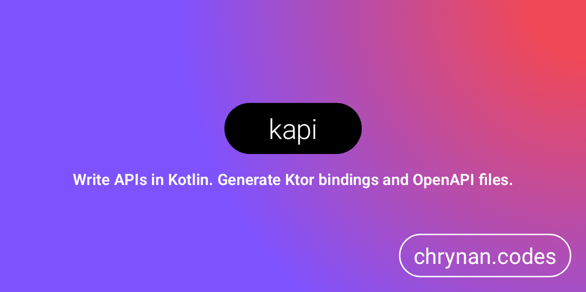

# kapi

Kotlin multi-platform API utilities. Write APIs in Kotlin; generate Ktor bindings and Open API Specs.
<br/>
<br/>


```kotlin
@Api
interface IdentityApi {

    @GET("/user/{id}")
    suspend fun getUser(@Path id: String): User
}

fun Application.module() {
    routing {
        // Function is auto-generated. Provide an `IdentityApi` instance.
        registerIdentityApi(api = IdentityApiImpl())
    }
}
```

## Status ⚠️

This project is in an early stage and under active development. Breaking changes may occur between released versions.

## Getting Started 🏁

First, set up the [KSP](https://kotlinlang.org/docs/ksp-quickstart.html) plugin. The following can be added to the
module's `build.gradle.kts` file to add the KSP plugin:

```kotlin
plugins {
    id("com.google.devtools.ksp") version "1.8.10-1.0.9"
}
```

Then, add the repositories for this project:

```kotlin
repositories {
    maven { url = uri("https://repo.repsy.io/mvn/chrynan/public") }
}
```

Finally, add the dependencies of this project:

```kotlin
dependencies {
    // The annotation processor - see ksp documentation for multiplatform builds
    ksp("com.chrynan.kapi:kapi-server-ksp:$kapiVersion")

    // The runtime library
    implementation("com.chrynan.kapi:kapi-server-core:$kapiVersion")
}
```

**Note:** It may be required
to [add the generated sources](https://kotlinlang.org/docs/ksp-quickstart.html#make-ide-aware-of-generated-code) of the
KSP processor for the IDE to recognize the generated code and resources. The following is an example of adding the
generated sources for a Kotlin JVM project:

```kotlin
kotlin {
    sourceSets.main {
        kotlin.srcDir("build/generated/ksp/main/kotlin")
        resources.srcDir("build/generated/ksp/main/resources/")
    }
}
```

## Defining an API 🧑‍💻

### API components

An API component can be a Kotlin interface, class, or object. Just annotate the API component with the `@Api` annotation
for the processor to register the component. The `@Api` annotation contains properties that can be provided that are
useful to the processor when it generates the Ktor bindings and Open API Spec files.

```kotlin
@Api(
    name = "IdentityApi",
    basePath = "/identity",
    info = Info(
        title = "Identity Service API",
        summary = "Provides API functions for accessing and updating user identities."
    )
)
interface IdentityApiComponent {}
```

### API functions

API functions are normal Kotlin functions of the API component that are annotated with an HTTP method annotation. These
functions correspond to HTTP methods at the specified path. For example, the following function, of the
`IdentityApiComponent` created above, will create an HTTP GET endpoint at `/identity/{id}`:

```kotlin
@GET("/{id}")
suspend fun getIdentity(@Path id: String): Identity
```

#### Supported HTTP Methods

* `@GET`
* `@POST`
* `@PUT`
* `@PATCH`
* `@DELETE`
* `@HEAD`
* `@OPTIONS`

An API function can only be annotated with one of the above supported HTTP method annotations. Each of the HTTP method
annotations has a required `path` property. A function in an API component that is not annotated with a supported HTTP
method annotation is not considered an API function and no endpoint binding will be created for it.

#### Parameters

Parameters of an API function must either be annotated with a supported parameter annotation, have a default value, or
be a supported type that can be provided by the generated code.

##### Supported Parameter Annotations

* `@Body` - Represents the HTTP request body.
* `@Field` - Represents a field from the HTTP request body when the content type is `application/x-www-form-urlencoded`.
* `@Header` - Represents an HTTP header extracted from the request.
* `@Part` - Represents a part of the HTTP request body when the content type is `multipart/form-data`.
* `@Path` - Represents a path parameter extracted from the URL of the request.
* `@Query` - Represents a query parameter extracted from the URL of the request.

##### Supported Types

API function parameters that are not annotated with the above annotations must either have a default value or be one of
the following types:

* `kotlin.Unit`
* `io.ktor.server.application.ApplicationCall`
* `io.ktor.server.routing.Route`

#### Extension Receivers

API functions may be extension functions of the following types:

* `io.ktor.server.application.ApplicationCall`
* `io.ktor.server.routing.Route`

This provides a way of accessing the underlying Ktor components for the endpoints for advanced use-cases.

#### Return Types

The value returned from an API function is the HTTP response of the endpoint. The content type of the HTTP response is
determined by the Ktor content negotiation plugin that must be set up separately from this library. Any type that works
with the Ktor content negotiation plugin can be returned from an API function. However, special handling is performed
for the `com.chrynan.kapi.core.Response` type, which will result in the `Response.body()` value being the HTTP response
of the endpoint.

#### Accepted Content Types

The kapi library provides a way to establish the accepted content types for a particular API function. This can be done
by annotating an API function with `@Consumes` (or an annotation whose class itself is annotated with `@Consumes`). An
API function can only support accepting a single specified content type, or any content type that is supported by the
Ktor content negotiation plugin that is set up. Here are some examples:

* `@Consumes("application/json")` - Accepts an HTTP request body with a content type of `application/json`.
* `@Consumes("*/*")` - Accepts any content type for the HTTP request body.
* `@Consumes("")` - Accepts any content type supported by the established Ktor content negotiation plugin.
* `@ContentNegotiation` - Same as the `@Consumes("")` usage - Accepts any content type supported by the established Ktor
  content negotiation plugin.
* `@ApplicationJson` - Accepts an HTTP request body with a content type of `application/json`.
* `@ApplicationFormUrlEncoded` - Accepts an HTTP request body with a content type
  of `application/x-www-form-urlencoded`.
* `@MultipartFormData` - Accepts an HTTP request body with a content type of `multipart/form-data`.

You can also create your own content type annotation like this:

```kotlin
@Consumes(contentType = "text/*")
@Target(AnnotationTarget.FUNCTION)
annotation class TextAny
```

If an API function is set up to accept a particular content type that is not a blank String value or "*/*", then this
will result in the generated Ktor endpoint being wrapped in an `accept(contentType) { ... }` function call.

#### Status Codes and Error Handling

An API function can be annotated with the `@Produces` annotation to indicate the success and error responses that the
function can return. For instance, the following function will respond with an `Identity` model and a status code
of `200` for a successful response when the function returns without an exception being thrown:

```kotlin
@GET("/{id}")
@Produces(
    success = Success(
        statusCode = 200
    )
)
suspend fun getIdentity(@Path id: String): Identity
```

When an API function throws an exception, that exception can be caught and result in an `ApiError` model (which is a
rough implementation of the [RFC-7807 specification](https://www.rfc-editor.org/rfc/rfc7807)) being the HTTP response of
the API endpoint, for example:

```kotlin
@GET("/{id}")
@Produces(
    success = Success(
        statusCode = 200
    ),
    errors = [
        Error(
            statusCode = 500,
            exception = IllegalStateException::class,
            title = "Internal Server Error"
        )
    ]
)
suspend fun getIdentity(@Path id: String): Identity
```

In the above example, if the `getIdentity` API function throws an `IllegalStateException`, that will result in an HTTP
response of type `ApiError` with a status code of `500`.

## Documentation 📄

More detailed documentation is available in the [docs](https://github.com/chRyNaN/kapi/blob/main/docs) folder. The
entry point to the documentation can be found [here](https://github.com/chRyNaN/kapi/blob/main/docs/index.md).

## Security 🛡️

For security vulnerabilities, concerns, or issues, please responsibly disclose the information either by opening a
public GitHub Issue or reaching out to the project owner.

## Inspiration 💡

This project was inspired by the works of the following open source projects and libraries:

* [retrofit](https://github.com/square/retrofit)
* [ktor](https://github.com/ktorio/ktor)
* [Ktorfit](https://github.com/Foso/Ktorfit)
* [ktor-retrofit](https://github.com/bnorm/ktor-retrofit)
* [OpenAPI](https://www.openapis.org/)
* [JAX-RS](https://en.wikipedia.org/wiki/Jakarta_RESTful_Web_Services)

## Sponsorship ❤️

Support this project by [becoming a sponsor](https://www.buymeacoffee.com/chrynan) of my work!

## License ⚖️

```
Copyright 2023 chRyNaN

Licensed under the Apache License, Version 2.0 (the "License");
you may not use this file except in compliance with the License.
You may obtain a copy of the License at

   http://www.apache.org/licenses/LICENSE-2.0

Unless required by applicable law or agreed to in writing, software
distributed under the License is distributed on an "AS IS" BASIS,
WITHOUT WARRANTIES OR CONDITIONS OF ANY KIND, either express or implied.
See the License for the specific language governing permissions and
limitations under the License.
```
